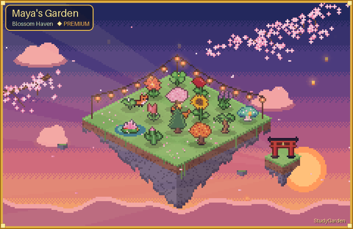
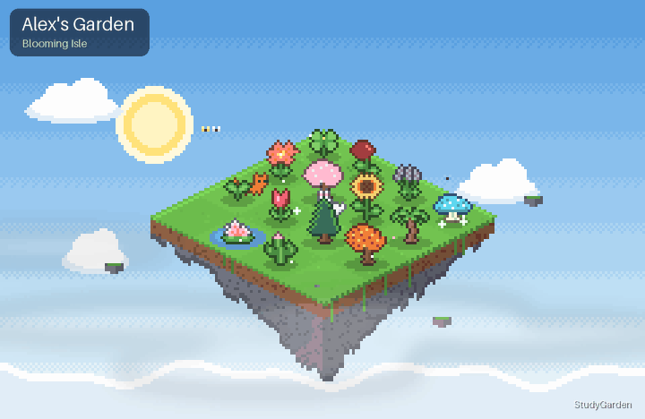
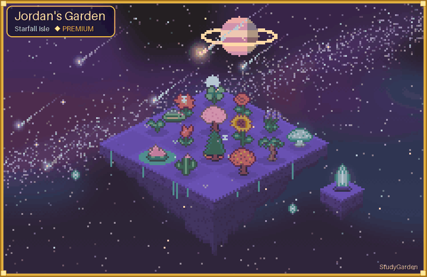

# 🌱 StudyGarden

**A Discord study bot that grows a garden while you focus.**

Start a focus session with `/focus` and a seed is planted on your own animated floating island.
Stay focused and it grows. Leave early and it withers. Over days and weeks your island fills up,
a living record of the time you've put in.

### [➕ Add StudyGarden to your server](https://discord.com/oauth2/authorize?client_id=1553869856934334506)

## ✨ Features

- ⏱️ **Focus sessions:** Pomodoro-style study timers with `/focus`
- 🏝️ **Your own island:** day and night that follow your time zone, weather and wandering pets
- 🌸 **15 plants and cute pets** to unlock with seeds you earn by focusing
- 🔥 **Daily streaks** with bonus seeds
- 📊 **Stats:** charts of your focus time
- ⏰ **Deadlines** with DM reminders
- 👀 **Study together:** see who's focusing in your server with `/studying`

## 💎 StudyGarden Premium ($2.99/month)

Sakura, Autumn, Winter and Cosmic theme scenes, weather and time-of-day control, 2 pets at once
plus the Fox and Baby Dragon, rare plants, streak freezes, full stats, unlimited deadlines and a gold frame.

**[Get Premium on Ko-fi](https://ko-fi.com/studygardenn/tiers)**, then type `/premium` in Discord and tap **I've paid**.

## 🚀 Get started

1. `/timezone` to set your local time
2. `/focus minutes:25` to plant your first seed
3. `/garden` to watch it grow

## 💬 Help

- Support server: https://discord.gg/Dfyu9T8TF
- Email: studygardenhelp@gmail.com
- [Terms of Service](terms) · [Privacy Policy](privacy)
